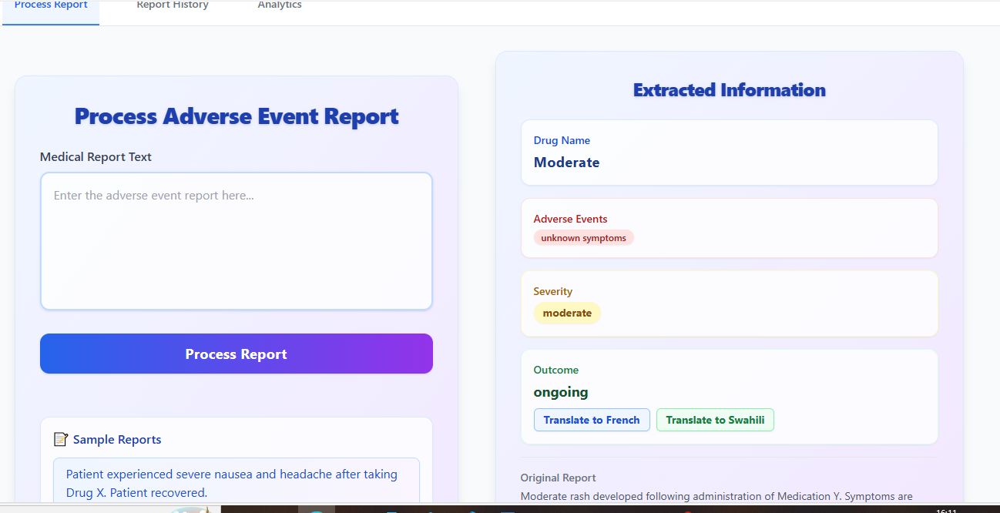
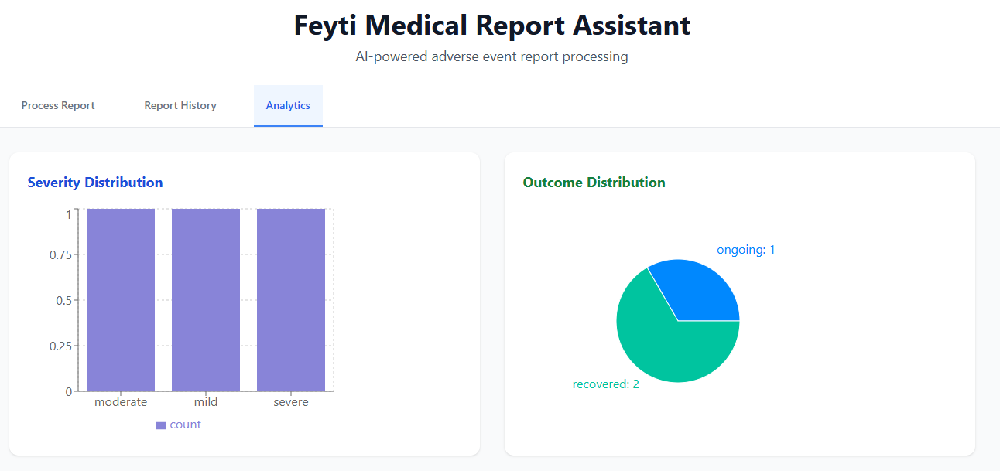

## User Interface

### Analytics Overview


### Dashboard


### Report History


### Analytics (Alternative View)

# Feyti Medical Report Assistant - Backend

## Overview

This is the backend API for the Feyti Medical Report Assistant, a powerful tool for processing and translating medical reports using AI technology.

## Features

- **Medical Report Processing**: Upload and process medical reports in PDF, DOC, DOCX, and TXT formats
- **AI-Powered Text Extraction**: Extract key medical information including:
  - Patient information
  - Diagnoses
  - Medications
  - Symptoms
  - Procedures
  - Lab results
  - Medical recommendations
- **Multi-Language Translation**: Translate medical reports between multiple languages
- **RESTful API**: Clean, well-documented API endpoints
- **Data Storage**: Persistent storage for processed reports
- **Comprehensive Testing**: Full test suite for reliability

## Technology Stack

- **Framework**: FastAPI (Python)
- **Database**: JSON file storage (easily replaceable with MongoDB/PostgreSQL)
- **AI/NLP**: Custom medical text processing algorithms
- **File Processing**: PyPDF2, python-docx
- **Translation**: Extensible translation system with support for multiple providers
- **Testing**: pytest with async support

## API Endpoints

### Health & Info
- `GET /` - API information
- `GET /health` - Health check

### Medical Reports
- `POST /upload-report` - Upload and process medical report
- `GET /reports` - Get all reports (with pagination)
- `GET /reports/{id}` - Get specific report by ID

### Translation
- `POST /translate` - Translate medical text

## Installation

1. **Clone the repository**
   ```bash
   git clone <repository-url>
   ```

2. **Create virtual environment**
   ```bash
   python -m venv venv
   source venv/bin/activate  # On Windows: venv\Scripts\activate
   ```
3. **Install dependencies**
  The `requirements.txt` includes the following (add if missing):
  ```
  fastapi
  uvicorn
  sqlalchemy
  pydantic
  python-docx
  ```
  Then install:


### Development
```bash
```

  # Feyti Medical Report Assistant – Backend

  The backend API for the Feyti Medical Report Assistant, providing AI-powered medical report processing, translation, and analytics.

  ## Features
  - FastAPI-based RESTful API
  - Process and extract structured data from medical reports
  - Store reports in SQLite database (`reports.db`)
  - Multilingual translation (French & Swahili)
  - NLP-based extraction using spaCy
  - CORS enabled for frontend integration

  ## Project Architecture

  ```
  backend/
  ├── app/
  │   ├── __init__.py
  │   ├── main.py         # FastAPI app and routes
  │   ├── models.py       # SQLAlchemy models
  │   ├── database.py     # DB connection and Base
  │   ├── utils.py        # Text processing utilities
  │   └── translation.py  # Translation logic
  ├── requirements.txt    # Python dependencies
  ├── test_api.py         # API tests
  ├── reports.db          # SQLite database
  └── README.md           # This file
  ```

  ## Prerequisites
  - Python 3.8 or higher
  - pip

  ## Setup & Installation

  1. **Clone the repository**
    ```bash
    git clone <repository-url>
    cd feyti-medical-report-assistant/backend
    ```

  2. **Create and activate a virtual environment**
    ```bash
    python -m venv venv
    # On Windows:
    venv\Scripts\activate
    # On macOS/Linux:
    source venv/bin/activate
    ```

  3. **Install dependencies**
    ```bash
    pip install -r requirements.txt
    ```

  4. **Download spaCy model**
    ```bash
    python -m spacy download en_core_web_sm
    ```

  5. **Configure environment variables**
    - Create a `.env` file for API keys and settings (see `.env.example` if available)

  ## Running the Application

  ### Development
  ```bash
  python -m uvicorn app.main:app --reload --host 0.0.0.0 --port 8000
  ```

  ### Production
  ```bash
  gunicorn app.main:app -w 4 -k uvicorn.workers.UvicornWorker --bind 0.0.0.0:8000
  ```

  The API will be available at: http://localhost:8000

  ## API Endpoints

  - `GET /` – API status/info
  - `POST /process-report` – Process a medical report
  - `GET /reports` – List all processed reports
  - `POST /translate` – Translate outcome text

  Interactive API docs:
  - Swagger UI: http://localhost:8000/docs
  - ReDoc: http://localhost:8000/redoc

  ## Database
  - Uses SQLite (`reports.db`) by default
  - Tables are auto-created on startup
  - To reset, delete `reports.db` and restart the backend

  ## Testing
  Run tests with:
  ```bash
  pytest test_api.py
  ```

  ## Troubleshooting
  - If you see `no such table: reports`, delete `reports.db` and restart the backend
  - Ensure the correct Python environment is activated
  - Check `.env` for required API keys


  For frontend setup, see `../frontend/README.md`.
# Using gunicorn
gunicorn app.main:app -w 4 -k uvicorn.workers.UvicornWorker --bind 0.0.0.0:8000
```

The API will be available at:
- **API**: http://localhost:8000


## Project Structure

```
backend/
├── app/
│   ├── __init__.py          # Package initialization
│   ├── main.py              # FastAPI application and routes
│   ├── models.py            # Pydantic models and data structures
│   ├── database.py          # Database operations and storage
│   ├── utils.py             # Medical text processing utilities
│   └── translation.py       # Translation services
├── requirements.txt         # Python dependencies
├── test_api.py              # Comprehensive test suite
└── README.md                # This file
```

## Medical Text Processing

The system can extract and identify:

- **Patient Information**: Name, age, gender, date of birth
- **Medical History**: Previous conditions, surgeries, allergies
- **Current Symptoms**: Chief complaints and symptom descriptions
- **Diagnoses**: Primary and secondary diagnoses
- **Medications**: Current medications, dosages, and prescriptions
- **Procedures**: Medical procedures and treatments performed
- **Lab Results**: Laboratory test results and vital signs
- **Recommendations**: Follow-up care and treatment recommendations

## Translation Support

Currently supports translation between:
- English (en)
- French (fr)
- Swahili

## Configuration

### Database Configuration
By default, the application uses JSON file storage for development. For production:

1. Install MongoDB or PostgreSQL
2. Update `database.py` to use your preferred database
3. Set the `DATABASE_URL` environment variable

### Translation Services
To enable real translation services:

1. Get API keys from Google Translate or Azure Translator
2. Set the API keys in your environment variables
3. Update `translation.py` to use the real services instead of mock translation

### Security
For production deployment:

1. Enable HTTPS
2. Configure CORS properly for your frontend domain
3. Add authentication and authorization
4. Implement rate limiting
5. Add input validation and sanitization

## API Documentation

The API is fully documented using OpenAPI/Swagger. Once the server is running, visit:
- http://localhost:8000/docs for Swagger UI
- http://localhost:8000/redoc for ReDoc documentation

## Error Handling

The API returns appropriate HTTP status codes:
- `200` - Success
- `400` - Bad Request (invalid input)
- `404` - Not Found
- `422` - Validation Error
- `500` - Internal Server Error


